# System Architecture

## High-Level Architecture Diagram

## RAG Data Flow

```mermaid
sequenceDiagram
    participant User
    participant Web
    participant API
    participant RAG
    participant Embeddings
    participant MongoDB
    participant LLM
    
    User->>Web: Submit Query
    Web->>API: POST /chat
    API->>RAG: performRAGQuery()
    
    RAG->>Embeddings: Generate query embedding
    Embeddings-->>RAG: Vector [n dimensions]
    
    RAG->>MongoDB: Find similar chunks
    Note over MongoDB: Cosine similarity search
    MongoDB-->>RAG: Top 5 chunks
    
    RAG->>RAG: Build context from chunks
    RAG->>LLM: Chat with context
    
    loop Streaming
        LLM-->>RAG: Token
        RAG-->>API: SSE Token
        API-->>Web: Stream Token
        Web-->>User: Display Token
    end
    
    RAG-->>API: Citations
    API-->>Web: Complete Response
    Web-->>User: Show Citations
```

## Document Processing Pipeline

## Key Components

### API Layer
- **Express Server**: RESTful API with Swagger documentation
- **Middleware**: Rate limiting (60 req/min), Prometheus metrics
- **Routes**: /chat, /upload, /tickets, /eval, /providers

### Service Layer
- **RAG Service**: Query orchestration, context building, citation extraction
- **Chunking Service**: Intelligent text segmentation with overlap
- **Upload Pipeline**: Multi-stage document processing
- **Evaluation Service**: Accuracy and latency benchmarking

### Provider Layer
- **Factory Pattern**: Dynamic provider selection with fallback
- **Mock Provider**: Development/testing with synthetic responses
- **Gemini Provider**: Google's Gemini API integration
- **Groq Provider**: Groq LLM API integration

### Data Models
- **Documents**: Uploaded files with processing status
- **Chunks**: Text segments with embeddings and metadata
- **Tickets**: Support tickets for similarity matching
- **Evaluations**: Test results for system performance

## Scalability Considerations

1. **Horizontal Scaling**: Stateless API design enables multi-instance deployment
2. **Vector Database**: Migration path to dedicated vector DB (Pinecone/Weaviate)
3. **Caching Layer**: Redis integration for embedding cache
4. **Queue System**: Background job processing for large documents
5. **CDN Integration**: Static asset delivery optimization